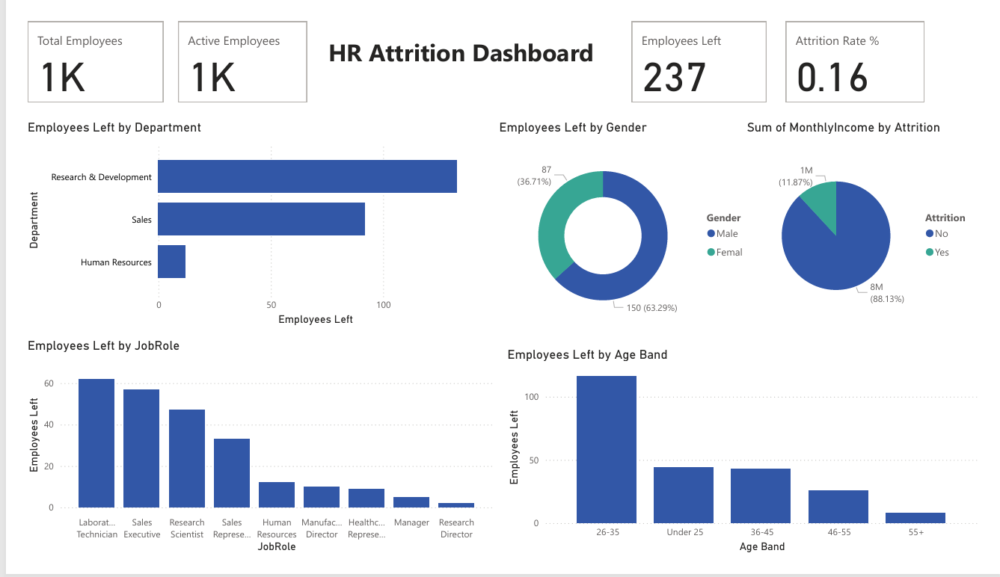

# HR Attrition Analysis Dashboard  

📊 An end-to-end **HR Analytics project** using Power BI that analyzes employee attrition trends and provides actionable insights for Human Resources decision-making.  

---

## 📌 Project Overview  
Employee attrition is one of the most critical challenges for organizations. This project demonstrates how data can be transformed into insights through:  

- **Data Preprocessing** (cleaning, handling missing values, grouping fields)  
- **Exploratory Data Analysis (EDA)**  
- **Interactive Dashboard in Power BI** to monitor and analyze attrition by various factors  

---

## 🗂️ Dataset  
File: **HR_Employee_Attrition_Cleaned.csv**  
- Rows: Each row = 1 employee record  
- Target: `Attrition` (Yes/No)  
- Key Features:  
  - **Employee Details**: Age, Gender, Education, Marital Status  
  - **Work Factors**: Department, JobRole, MonthlyIncome, OverTime, JobSatisfaction  
  - **Performance/Promotion**: PerformanceRating, YearsAtCompany, YearsSinceLastPromotion  

Derived Columns:  
- **Salary Band** → Low / Medium / High  
- **Age Band** → Under 25, 26–35, 36–45, 46–55, 55+  
- **Experience Group** → Early, Mid, Senior  

---

## ⚙️ Project Steps  
1. **Data Understanding** → Identified key variables for attrition analysis.  
2. **Data Cleaning** → Removed duplicates, created derived fields.  
3. **EDA** → Found attrition rates by department, salary, and experience.  
4. **Dashboard Modeling** → Created DAX measures for KPIs.  
5. **Power BI Dashboard** → Designed professional, interactive visuals.  

---

## 📊 Dashboard Features  
- **KPIs (Cards):**  
  - Attrition Rate (%)  
  - Total Employees  
  - Employees Left  
  - Avg Years at Company  

- **Visuals:**  
  - Attrition by Department & Job Role (Bar Charts)  
  - Attrition by Gender (Donut Chart)  
  - Attrition by Age Band (Column Chart)  
  - Attrition vs Salary Band (Stacked Column Chart)  

- **Filters (Slicers):**  
  - Department  
  - Gender  
  - Age Band  
  - Experience Group  

---
## 📷 Dashboard Preview  



---

## 🔑 Key Insights  
- Highest attrition is in **Sales & R&D departments**.  
- **Younger employees (<30)** with **low salaries** are most likely to leave.  
- Employees with **OverTime = Yes** have almost **2x attrition rate**.  
- **Low Job Satisfaction** strongly correlates with higher attrition.  

---

## 📂 Files in Repository  
- `HR_Employee_Attrition_Cleaned.csv` → Cleaned dataset  
- `HR_Attrition_Dashboard.pbix` → Power BI dashboard file  
- `preprocessing.ipynb` / `preprocessing.py` → Data cleaning & preparation script  

---

## 📝 How to Use  
1. Clone the repo:  
   ```bash
   git clone https://github.com/<your-username>/HR-Attrition-Dashboard.git
   cd HR-Attrition-Dashboard

2. Open HR_Attrition_Dashboard.pbix in Power BI Desktop.

3. Explore dashboard with slicers and filters.

